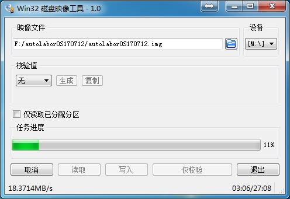
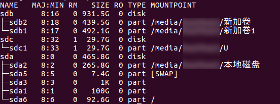
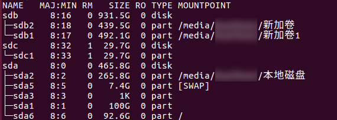

# 安装操作系统

如果你的操作系统运行异常、或准备清空文稿资料，本文将引导你如何安装出厂版本的操作系统。

PM1 导航套件的操作系统，存储在 SD 卡中，如想恢复系统，只需重新烧写 SD 卡。

## 准备

* Autolabor Nano OS  镜像文件 * 1

> Autolabor Nano OS 镜像[下载](http://www.autolabor.com.cn/download)。

* SD 卡读卡器 * 1


取出 SD 卡，放入读卡器中。

## Windows操作系统

如果您使用Windows操作系统，推荐使用 [win32diskimager](https://sourceforge.net/projects/win32diskimager/) 进行烧录。



点击写入，等待烧录完成。


如果您使用Linux/OSX操作系统，可使用内置工具dd进行烧录.

## Linux操作系统

* 准备SD卡
* 打开命令窗口，su切换到root用户
* 查看SD卡，在往里写入数据前，先将SD卡取消挂载，避免在写入的时候对其进行了操作，影响烧录（已经取消挂载的，可省略此步）
    * 查看硬盘信息

            lsblk

        

        可以看到SD卡相关信息，路径为/dev/sdc，挂载地址为/media/xxx/U

    * 取消挂载

            umount /dev/sdc1

* 再次查看硬盘信息，可以看到SD卡后没有挂载目录信息，即取消挂载成功

        lsblk

    

* 开始烧录

        dd bs=4M if=/home/…/AutolaborNanoOS.img of=/dev/sdc

    if是镜像路径，of是写入SD卡路径，【写入路径一定要仔细确认，如果路径错误，就把别的硬盘给洗了，此操作不可恢复】   在烧录的过程中，不要操作该窗口，避免烧录过程停止

* 新开一个窗口(ctrl+alt+T)，root用户查看烧录进度

        su
        watch -n 5 killall -USR1 dd

    

* 完成烧录

## OSX操作系统

把ISO镜像转换为一个可启动的USB设备。一种可行的方法是通过OS X的Terminal “浇灌”到目标卷中。

这的注意的是：用Mac OS X 用户账户会有一些提示，这时用 sudo su 登入 root 或者 sudo ［commond］。

还有一点是记得备份你USB驱动器的内容，因为这会擦除你的USB驱动器。预先准备，转换iso成dmg

```
hdiutil convert -format UDRW -o ~/linux.dmg /tmp/linux.iso

```

1、diskutil list

2、卸载目标驱动器

```
sudo umount /dev/(IDENTIFIER)    ==>  IDENTIFIER 为目标驱动器标志符（卷标）

```

```
我的U盘卷标为disk2s1  执行 ==> sudo umount /dev/disk2s1

```

3、浇灌

```
sudo dd if=源路径  of=/dev/r卷标  bs=1m      ［‘r’  会让命令执行加快一点］ ［‘bs’ 为一次填充的容量］

```

```
sudo dd if=~/Desktop/Windows10_x64_EN-US.iso of=/dev/rdisk3s2  bs=1m

```

4、等待...

5、完成后 弹出

```
diskutil eject /dev/(IDENTIFIER) ［‘IDENTIFIER’为卷标］

```
