# 定位循迹

## 功能简介

定位循迹是机器人循着用户提前录好的轨迹自主行走，行走过程中机器人能够自动躲避障碍物，自动规划路线，达到目标点。

软件上提供了可视化的操作按钮和开发接口，可在行走途中对机器人发送停止/启动的指令，用户可以根据自己的需要对机器人进行二次开发。

定位循迹使用的定位系统，能够为机器人、自动驾驶车辆、无人机等设备提供 ±2cm 的定位精度。定位系统覆盖范围与定位标签的配置方式和使用个数有关。

[>>详细了解定位系统](../marvelmind/doc)

## 操作步骤

1. 搭建定位系统
2. 循迹

### 一、搭建定位系统

定位系统中包含 车载定位标签，定位标签，定位路由。

车载定位标签又称为车载移动定位标签，它安装在车上，随车移动。

定位标签又称为固定标签，可将标签固定在高处（墙上、支架）或放置在平稳无遮挡的地方，使用的个数取决于用户的需求。

定位标签包含5个超声波换能器，收发各个方向的超声信号。

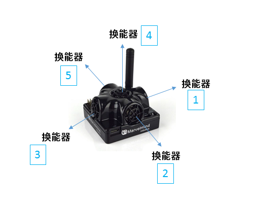

定位路由是整个定位系统的中心控制器，系统工作时路由必须一直在线，定位路由中没有电池，必须使用供电电源为它供电，如路由没有电源，定位系统会无法工作。

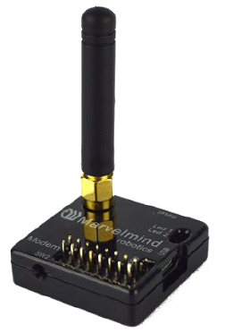

[>>详细了解定位标签与路由](../marvelmind/doc)

#### 准备工作

1. 给定位标签充电

打开包装，连接 micro USB 线给定位标签充电，可使用手机充电器(5V)、充电宝(5V)或者电脑 USB 接口充电。

充电时定位标签上 Led1 充电时常亮，充满后不亮。从低电量到充满电大概需要1-2小时。

注：车载定位标签上自带的的串口数据线是作通信用，非充电线。

2. 打开定位标签开关

两个拨码开关，DFU 保持远离 LED 指示灯，右侧 为电源开关/ Power，拨到靠近 LED 指示灯位置为开。

Power 打开后，如定位标签有电，Led2 灯会以大概 10s 的频率闪烁。

3. 打开软件——Dashborad（[下载](http://www.autolabor.com.cn/download)）

打开 Dashboard 软件，使用 micro USB 线连接设备到电脑，Dashboard 识别后将会显示配置信息。

4. 确认配置

确认固件版本与配置参数，如与以下内容不同，可参考文末【恢复出厂配置】的教程重新配置。

1. **定位路由：**

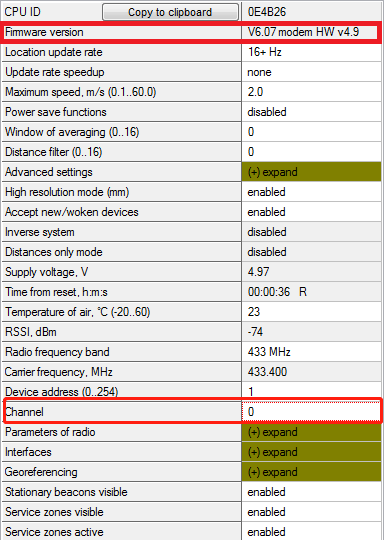

Firmware version -> V6.07 modem HW v4.9

Channel -> 0

2. **车载定位标签：**

Firmware version -> V6.07 beacon HW v4.9

Hedgehog mode -> enable

Channel -> 0

UART speed -> 115200

3. **固定定位标签：**

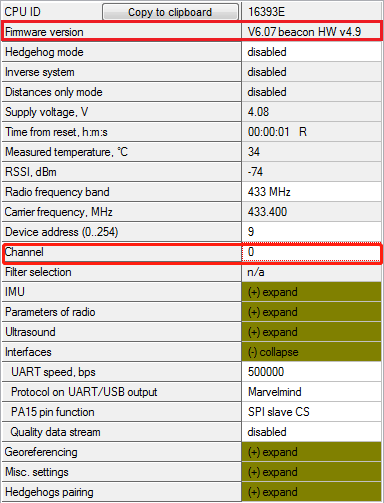

Firmware version -> V6.07 beacon HW v4.9

Channel -> 0

准备工作结束，开始准备搭建。

#### 开始搭建

以室内4个固定标签为例，快速搭建一个小范围的定位系统（需要4个固定标签+1个车载移动标签+1个路由，关闭其他用不到的标签电源开关），步骤如下：

1. 固定定位标签

按照以下规则，将**电源已打开**的4个固定标签固定到墙壁或其他可安装位置上。

>为减少遮挡的情况，标签位置尽量高，例如1.8m 以上

>标签相对地面等高且需要测量出高度值

>标签必须两两之间可见（无遮挡、有换能器相对）

>标签尽量分散开，避免4个标签中有3个甚至全部在一条直线上

>建议任意标签之间的距离控制在20m 以内（理论最大30m）

>移动标签应在固定标签围成的区域内部运动，布置固定标签时还应考虑此因素

2. 建立地图

打开 Dashboard 使用micro USB 线连接路由到电脑，连接成功后左下角显示 modem。

如非首次使用，本次标签位置与最后一次建图时位置一致，则可跳过此步骤。

如重新建图，则需清除路由中可能已经存储的地图，点击设备列表右侧的 Erase map 按钮清除地图，然后点击 Submap 0 按钮。

3. 点击设备列表中固定标签对应编号(beacon xx) 唤醒标签，过程大概需要10s。

4. 点击设备列表中某个在线的标签，则右侧列表为该标签的参数设置。依次设置4个固定标签的 Height 参数为标签布置的高度，注意单位为 m。

5. 地图会自动构建。等待地图显示中四个绿色固定信标位置基本不再变化、左上角距离表全部为白色、且 freeze map 按钮上方显示橙色 `Freeze submap!` 字样后，点击 freeze map 按钮锁定地图。

如果锁定后的地图与实际情况顺序相反（例如地图中从1到2到3是逆时针而实际布置的是顺时针），点击镜像按钮翻转地图。

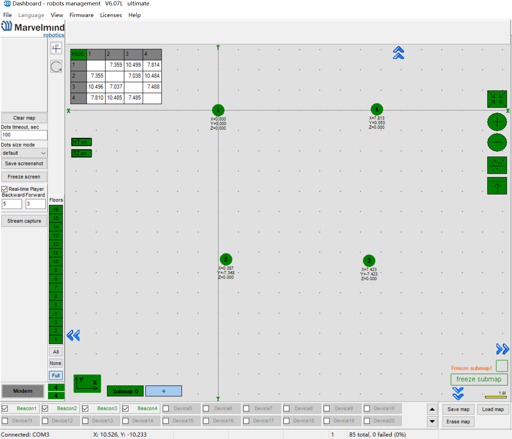

**距离表 ↓**

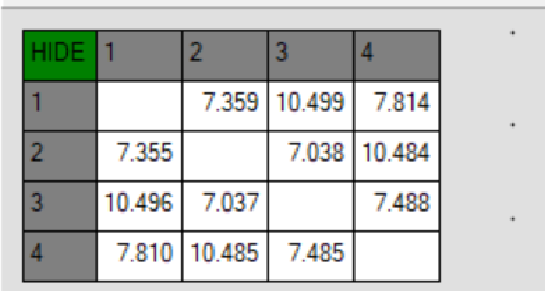

**freeze map ↓**

**镜像按钮 ↓**

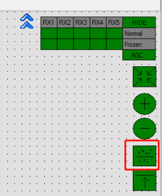

6. 点击设备列表中的车载标签，设置车载标签相对地面的高度。

7. 此时定位系统已经开始工作，可在 Dashboard 的地图中查看车载移动标签的运动轨迹。

配置完成后，定位循迹功能不再依赖 Dashboard 软件，只需保持定位路由的供电，数秒后即可从车载移动标签的串口读取到机器人的定位坐标。

注：

1. 定位路由连接 Dashboard 后，可在参数列表中查看所有标签的电量（电压），当标签电量过低时界面上会有红色文字提示（满电约为4.2 ），电压不足会影响定位效果。

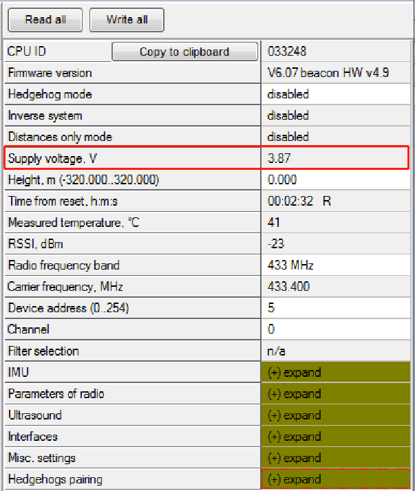

2. 停止使用定位系统时，只需将定位路由断电即可，1min 后所有标签会自动进入睡眠状态。长时间不使用时请关闭标签电源开关，左侧开关保持不变，右侧电源开关拨下。

以上即完成定位系统的搭建

### 二、循迹

#### 操作步骤

1. 车载定位标签测试

2. 激光雷达测试

3. 开始循迹

4. 终止循迹

***

##### 车载定位标签测试

准备工作：

1. 打开电源

2. 远程连接到机器人端

3. 确保所有线材连接正确，确认车载定位标签的 USB 线插正确的 USB-Hub 口上

定位系统设置完毕，定位路由开始工作后，车载定位标签上面会闪着红灯，并发出“哒哒哒...”的高频声音，代表标签功能正常。

进入桌面测试文件夹，点击标签测试，查看 RVIZ 中是否有紫色的点，如有数据则表示连接正常。

##### 常见问题：

1. 测试时没有显示紫色数据

  1. 检查 PM1 是否在标签部署范围内，打开 Dashboard 软件，检查地图中标签数据是否正常，是否有车载定位标签的蓝色点数据

  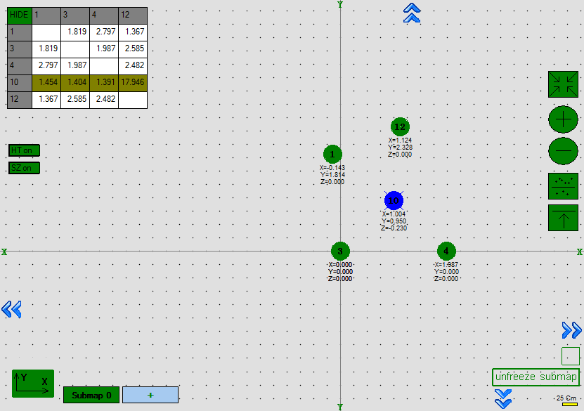

  2. 检查车载定位标签的波特率，正确应为115200，如不是则查看文末“恢复出厂设置”内容，重新设置
    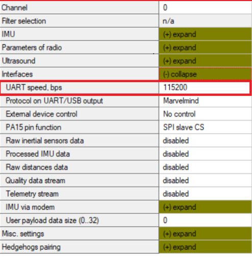

  3. 检查车载定位标签的数据线是否插在 USB-Hub 的指定接口上，指示灯是否亮着
  4. 检查 USB-HUB 的电源线是否插好，数据线是否插在 Mini 计算机的指定接口上
  5. 打开 terminal，执行以下命令内容，查看是否有"box_3"这个设备

  `$ ll  /dev/box_*`

  如以上检查都正常，拔插定位标签数据线，在 terminal 中执行以下命令内容，将打出日志从后往前翻，查看是否有红色报错，将报错信息截图发送给客服

    `$ dmesg`

***

##### 激光雷达测试

1. 进入桌面测试文件夹，点击雷达测试
2. 查看 RVIZ 中是否有红色与黄色激光雷达数据，如有则激光雷达功能正常

##### 常见问题：

看不到激光雷达数据？

  1. 检查激光雷达是否插在 USB-Hub上指定的口，前侧雷达插前雷达，后侧雷达插后雷达
  2. 检查激光雷达指示灯是否亮着，数据线两头是否插紧
  3. 检查 USB-HUB 的电源线是否插好，数据线是否插在 Mini 计算机的指定接口上
  4. 打开terminal，执行以下命令内容，查看是否有"box_1"与"box_2"这两个设备

  `$ ll  /dev/box_*`

  如以上检查都正常，拔插激光雷达数据线，在 terminal 中执行以下命令内容，将打出日志从后往前翻，查看是否有红色报错，将报错信息截图发送给客服

    `$ dmesg`

***

##### 开始循迹

1. 录制轨迹

打开桌面 定位循迹 文件夹，点击 **开始循迹**

程序打开RVIZ后，可以看到界面中显示了 PM1 模型代表 PM1，红色的点为前置激光雷达数据，黄色的点为后置激光雷达数据，紫色的路线为录制的轨迹。

注：即使用户从未录制轨迹，首次打开程序界面上也会显示一条轨迹，此为系统预置轨迹，用户录制轨迹后，此默认轨迹会被覆盖。

使用手柄控制 PM1 遥控走一段路，如从未录制过轨迹，在走的过程中 PM1 在RVIZ 中会持续跳动，此时 PM1 是在进行地图坐标匹配，当 PM1 不再跳动时，则表示稳定， 走3-5m，边走边转动，障碍物信息不再变化（跳），如下图所示。

如已经录有历史轨迹，遥控 PM1 走一段后，会直接跳到某一位置，表示 PM1 已经在（定位系统）地图中找到自己的位置。

点击 RVIZ 工具栏下方的【录制轨迹】按钮，控制 PM1 在目标路径上走一圈。

注：录制的轨迹需闭合。

录制完成后，点击【保存轨迹】按钮。

2. 开始循迹

点击左下角按钮【开始任务】，循迹任务开始

机器人在刚刚录制的路线上开始了循迹任务：

3. 停止循迹

如想要停止循迹，点击【停止任务】，循迹任务停止。

注：

1. 如下次再次使用时，仍是在无需录制轨迹的同一环境中，则可跳过录制路线的步骤，测试完毕后直接执行循迹功能。
2. 如重新录制路径会清除上一次已保存的地图。

[>>常见问题](/usedoc/pmNavigationkit/common/q_a/doc3)

***

## 补充知识

#### 恢复出厂配置

1. 初始化定位路由

    1. 使用micro USB 线将定位路由与电脑连接，点击 Dashboard 右下 Default 按钮加载默认配置。

        Channel -> 0

        一套定位系统中，路由和标签要保持同一 Channel/频道，这样才能进行通信。

    2. 查看 固件型号 ， Firmware version - >  V6.07 modem HW v4.9 如不相同，则需更新固件。

        点击 dashboard 左上角 firmware ，点击 Upload firmware。

        

        选择固件

        

        路由固件为：modem

        

        固件更新过程中，注意不要拔出，烧写完成后点击 OK，固件更新完毕。

        

5. 初始化定位标签

    1. 使用micro USB 线将定位标签与电脑连接

    2. 点击 Dashboard 右下 Default 按钮加载默认配置

    3. 然后查看标签 id (Device address)，将此参数与标签外壳上贴的数字保持一致。

    4. 如标签外壳上未贴数字，用户可自行对标签进行编号，按照顺序 id 从 2开始设置，逐个递增，修改后将 id 标记到标签外壳上方便使用过程中进行区分，注意不要出现重复的 id。

    5. 开启换能器开关

        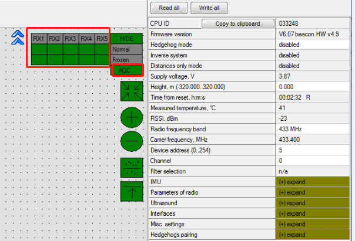

        点击右上 RX1 -> RX5 的方格，使所有方格都为绿色。

        模式为 AGC 模式

    6. 查看 固件型号 ， Firmware version - >  V6.07 beacon HW v4.9 如不相同，则需更新固件。

        固件烧写方法与路由一致，注意选择对应的固件。

        标签固件为：beacon

        

6. 初始化车载定位标签

    首先执行上一步操作初始化标签，接着配置 Hedgehog mode 设置为 enable，将配置 Interfaces 的第一个子项 UART speed 设置为115200。

      

以上标签恢复出厂完毕。
