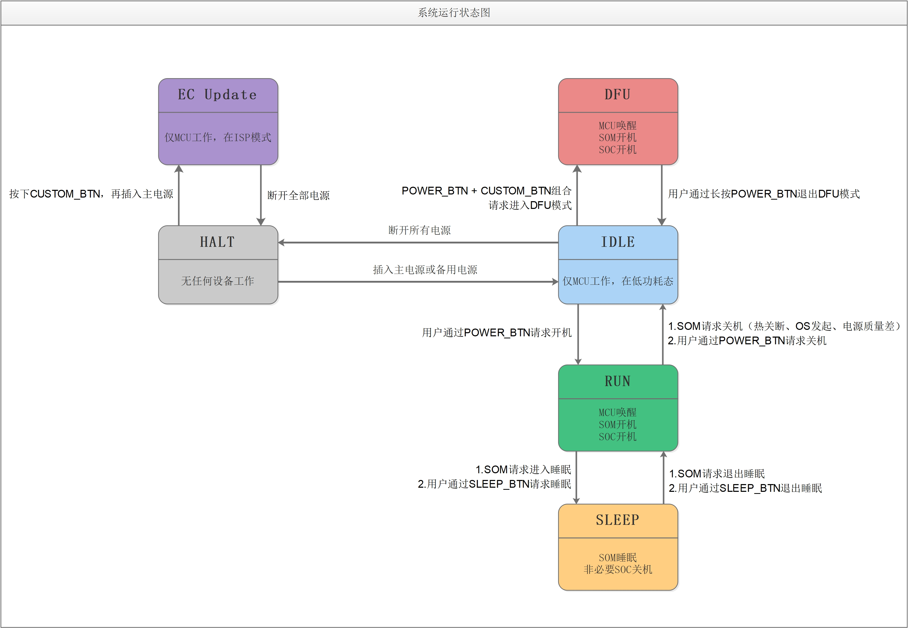

<!--
 * @Description: 
 * @Date: 2020-09-11 18:51:20
 * @LastEditors: CK.Zh
 * @LastEditTime: 2021-01-07 18:40:28
 * @FilePath: \pm1-navigationkit-docs\source\user_guide\mother_board\doc.md
-->
# 简介

这是一款以Jetson Nano为计算核心，拥有高可扩展性，面向移动机器人平台的高性能计算机。

# 技术规格

* 扩展性

|              | 速率     | 个数 | 备注                                                                      |
|--------------|----------|------|---------------------------------------------------------------------------|
| *USB2.0*       | 480Mbps  | 6    | `typeA`   用于扩展硬件外设                                                          |
| *USB2.0*       | 480Mbps & 12Mbps      | 3    | `typeC`   EC升级、调试 x 1   Jetson Nano USB Device x 1   Jetson Nano 串口终端 x 1 |
| *USB3.0*       | 5000Mbps | 6    | PCIe控制器 x 4   USB-HUB x 2                                              |
| *以太网*       | 1000Mbps | 2    | PCIe-以太网 x 1     USB-以太网 x 1                                         |
| *HDMI2.0*      | 18Gbps   | 1    | 输出                                                                        |
| *局域网交换机* | 1000Mbps | LAN x 5    |   其中一路接入Jetson Nano                                    |

* 电源

|            |                                                   |
|------------|---------------------------------------------------|
| *主电源输入* | 直流19-29v     3A以上                         |
| *备用电源*   | 12v（标称）铅酸蓄电池     充电电流 1A（最大） |
| *12V输出*    | 单口最大3A   合计4A                           |
| *24V输出*    | 1A （非标PoE）                                    |
| *5V输出*     | 单USB口最大3A   合计8A                        |
| *待机电流*   | 仅主电源：约5mA   仅备用电池：约500uA       |

# 功能描述

* 1 : 主电源输入，19V-29V
* 2 : 备用电池，12V(标称)铅酸蓄电池
* 3 : 12V电源输出
* 4 : 自定义按键
* 5 : EC(Embedded Controller 嵌入式控制器)升级/日志接口（仅Device）
* 6 : LAN0 默认100Mbps + 24V PoE; 可选:1Gbps, 无PoE
* 7 - 9 : LAN1 - LAN3, 1Gbps
* 10 : WAN, 1Gbps
* 11 : SOM 串口终端 （仅Device）
* 12 : SOM DFU（仅Device）
* 13 : HDMI 输出
* 14 - 19 : USB2517, #1 - #6
* 20 - 21 : RTS5411, #3 - #4
* 22 - 25 : VL805, #1 - #4

# 电源模式状态机

## 开机

1. 关机状态下，长按`电源`按钮；
2. 听到滴声后，松开按钮;
3. 开机后电源灯为`常亮`状态

## 关机
1. 在操作系统中点选关机按钮或键入关机指令，或短按`电源`按钮，触发操作系统弹出`关机对话框`；
2. 关机后电源灯为`熄灭`状态
## 强制关机

1. 开机/DFU状态下，长按`电源`按钮；
2. 听到滴声后，松开按钮;
3. 关机后电源灯为`熄灭`状态

## 重启
> 仅重启SOM，其它外设正常运行

1. 开机/DFU状态下，长按`重启`按钮；
2. 听到滴声后，松开按钮；
3. 系统重新启动
## DFU

> Device Firmware Update, 用于在Linux下使用Nvidia SDK Manager软件,为Jetson Nano 烧写系统或安装JetPack组件。
> 当Jetson Nano为eMMC（无SD卡）版本或SD卡不便拆装，可以在该模式为Jetson Nano刷机。

 * 进入方法：
    1. 关机状态；
    2. 按下`重启`按钮；
    3. 按下`电源`按钮；
    4. 听到`3次滴声`后，松开两个按钮。（电源灯为`闪烁`状态）
    5. 检查Host PC是否有一个名为`Nvidia Crop. APX`的设备

## EC升级

> 针对主板的基础功能控制器的固件升级

* 固件及升级工具： https://github.com/autolaborcenter/EmbeddedProductData

* 进入方法：
   1. 断开主板的主电源和备用电源10秒钟以上（使EC彻底断电），并将主板EC对应的USB typeC接口和Host PC连接；
   2. 先按下`重启`按钮，再插入主板的主电源，听到`5次滴声`后，松开`重启`按钮；
   3. 打开STM32CubeProgrammer，选择UART模式，点击Connect；
   4. 点击Open，选择新固件，点击Download；
   5. 下载完成后，断开与主板的主电源以及备用电池，并重新连接电源即可。

## 主电源&备用电源

| 主电源 | 备用电源 | 系统电力来源 |
|-|-|-|
| 已连接且功率正常 | 已连接且满电 | `主电源优先`|
| 已连接且功率正常 | 已连接但未充满电 | `主电源优先`   （同时主电源为备用电源充电）|
| 已连接但功率不足 | 已连接 |  `主电源和备用电源`|
| 已连接 | 未连接 | `主电源` |
| 未连接 | 已连接 | `备用电源`   （该模式下系统续航能力有限，请尽快接入主电源或关机）|

# 常见问题

* “按下开机按钮后蜂鸣器`滴滴两声`但无法开机/开机状态下每间隔若干秒蜂鸣器`滴滴两声`？”
  
  `滴滴两声`有两种情况：
  “关机状态下：主电源电压过低或主电源未插入时，主板不响应开机请求，请检查主电源后重试。”
  “开机状态下：主电源电压过低或主电源被移除，目前为备用电源供电状态，请尽快保存数据并关机。”
  
  
# 故障诊断方法
* 交换机
    * 系统启动后交换机口对应的所有LED会点亮一次后熄灭
    * 千兆以太网为黄色+绿色

* Jetson NANO
    * 系统启动后，Jetson NANO对应网口的LED会点亮一次后熄灭
    * `SOM-DBG`口可作为串口终端登录操作系统，亦可查看计算机的底层日志输出

* USB 
    * 0-11（共12个）USB口提供VBUS供电状态指示灯（红色LED）
    * 0-8（共8个）USB口提供主机枚举状态指示灯（蓝色LED）
    * 部分设备可能会在操作系统不访问时进入休眠状态（蓝色LED熄灭）
    * 使用`usbview`（GUI）或`lsusb -t`查看设备信息及工作状态
 

