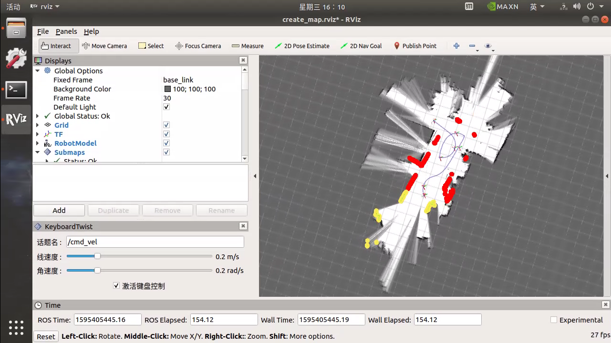
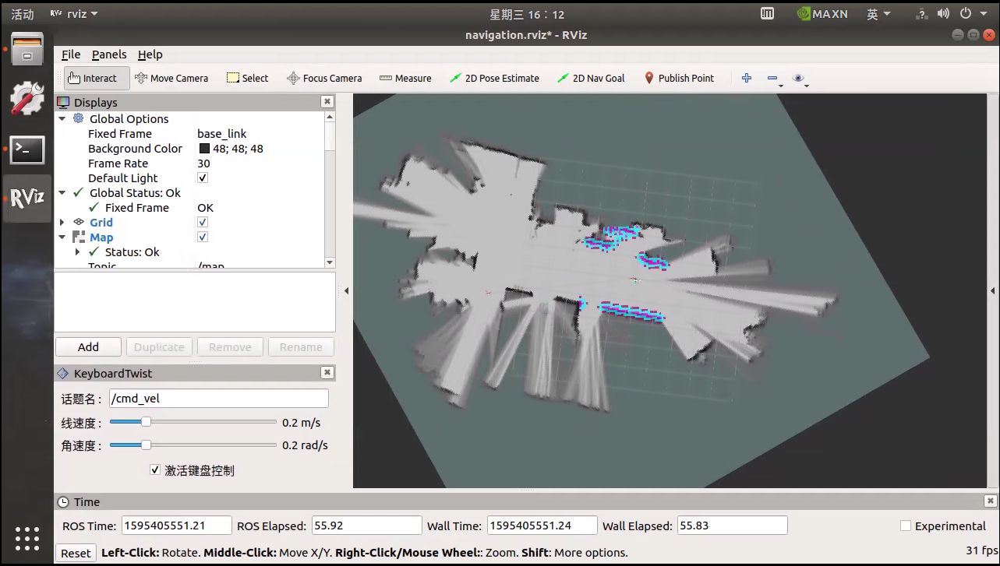
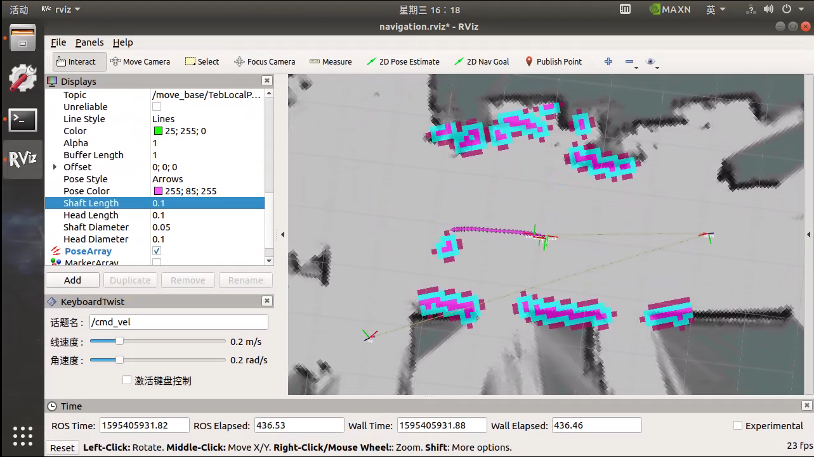

# 建图导航

## 操作步骤：

以下步骤要求用户端已连接到机器人端

进入到桌面 SLAM 建图导航文件夹

## 一、 点击【开始建图】

RVIZ工具打开，能够看到地图中的 PM1。

地图中，红色是前置激光雷达实时数据，黄色是后置激光雷达实时数据，颜色从白至黑为障碍物的几率是0%~100%。

##### 1. 确认 PM1 的急停没有按下，PM1 周围有充足的可运动空间

##### 2. 在 RVIZ 中勾选【激活键盘控制】，使用键盘控制机器人运动，开始建图，建图速度不宜过快，控制机器人走 S 型路线

建图注意事项：

* 轮胎气不足影响里程计数据

* 运行速度不宜过快，由于激光扫描有一定的频率，车速低时雷达可以扫描到的点更多，构建的地图会更准确一些

* 走一个来回，增加激光雷达扫描次数，累计更多的数据

* 地图构建的质量也受环境限制，请尽量选择特征比较明显的环境，玻璃、镜子、楼道、空旷等场景会影响建图效果

* 构建完成的地图，会发现有些点会飞出，飞出的点可能是由于物体的表面不平或者有空隙激光直接穿越了过去

* 当场景很大特征不足的时候，需要规划建图路径时，应先走一个小回环，当回环成功后，可以再多走几圈，消除粒子在这个回环的多样性。接下来走下一个回环，直到把整个地图连通成一个大的回环

## 二、 建图完毕，点击【保存并停止建图】

## 三、 点击【开始导航】
RVIZ工具打开，建好的地图会自动加载。

注意：一定要点击【保存并停止建图】后完成建图（不能直接关闭RVIZ窗口），才能进行导航，否则会找不到地图文件产生报错。

##### 1. 初始化定位

在 RVIZ 中勾选【激活键盘控制】，使用键盘控制机器人运动，行走一段距离后，当激光雷达的数据与实时的环境匹配成功时（如上图中的颜色点与地图环境的重合），即是机器人初始化成功。

##### 2. 关闭键盘控制 

<b style="color:red;">取消勾选【激活键盘控制】</b>，控制方式将切换至导航程序控制，如不切换机器人接收到目标点命令后将不会自动导航行走。

##### 3. 给定目标点

点击 2D Nav Goal，指定目标位置，拉动鼠标，箭头方向是最终车辆运行至目标的车头朝向，鼠标松开，这样就完成了目标点的指定。

目标点给定后在地图中我们能看到一条线，这是规划好的路径。根据这个规划好的路径，PM1 向目标点行走。

当PM1已经到达目标点后，再一次使 2D Nav Goal 设置目标位置，PM1将去到下一个目标点。

## 四、 点击【终止导航】，停止导航功能，导航结束。

之后在同一环境中需要再次使用导航功能时，无须重复建图，点击【开始导航】即可。

